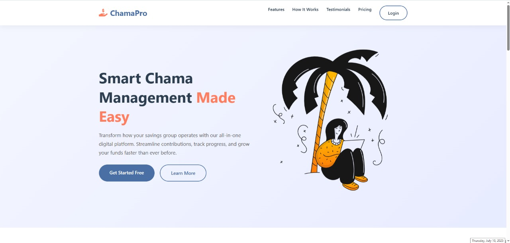

# ChamaPro - Collaborative Savings Platform 🚀

 <!-- Replace with your logo if available -->

ChamaPro is a modern digital platform for managing "chamas" (rotating savings groups) with features for contribution tracking, group management, and financial accountability - all designed to make collective saving easier and more engaging.

## Live Demo 🌐

The application is currently deployed at:  
🔗 [https://chamapro.kesug.com/](https://chamapro.kesug.com/)

## Table of Contents
- [Features](#features-)
- [Screenshots](#screenshots-)
- [Demo Video](#demo-video-)
- [Technology Stack](#technology-stack-)
- [Installation](#installation-)
- [Configuration](#configuration-)
- [Running the App](#running-the-app-)
- [Testing](#testing-)
- [Contributing](#contributing-)
- [License](#license-)

## Features ✨

### Core Features (MVP)
- **Group Creation & Membership**
  - Create chamas with custom names, descriptions, and goals
  - Role-based access (Admins/Members)
  - Invite system for new members

- **Contribution Tracking**
  - Set periodic contribution targets
  - Payment proof uploads
  - Visual progress tracking with interactive charts

- **Activity Feed**
  - Real-time updates on member contributions
  - Achievement badges and recognition system

- **Accountability Tools**
  - Automated reminders for contributions
  - Peer accountability features

### Premium Features
- Advanced data visualization
- Custom group themes
- Detailed analytics dashboards
- PDF report generation

## Screenshots 📸

### Landing Page
 <!-- Replace with actual path -->

### User Authentication
<div style="display: flex; gap: 10px;">
  
  
</div>

### Dashboard


## Demo Video 🎥

Watch my full application walkthrough:

[](./demo.mp4) <!-- This will embed a clickable thumbnail -->

## Technology Stack 💻

### Frontend
- React.js
- Redux (State Management)
- Axios (HTTP Client)
- Chart.js (Data Visualization)
- Tailwind CSS (Styling)

### Backend
- Node.js
- Express.js
- MongoDB (Database)
- Mongoose (ODM)
- JWT (Authentication)

### DevOps
- Git (Version Control)
- Render/Vercel (Deployment)
- Postman (API Testing)

## Installation ⚙️

### Prerequisites
- Node.js (v18 or higher)
- MongoDB (local or Atlas cluster)
- npm or yarn

### Steps
1. Clone the repository:
   ```bash
   git clone https://github.com/yourusername/chamapro.git
   cd chamapro


Configuration ⚙️
Create a .env file in the server directory with the following variables:
MONGODB_URI=your_mongodb_connection_string
JWT_SECRET=your_jwt_secret_key
PORT=5000
CLIENT_URL=http://localhost:3000


Running the App ▶️
Start the backend server:
npm run dev


The application should now be running on http://localhost:3000

Testing 🧪
To run tests for both frontend and backend:

# Backend tests
cd server
npm test

# Frontend tests
cd ../client
npm test


Contributing 🤝
We welcome contributions! Please follow these steps:

Fork the project

Create your feature branch (git checkout -b feature/AmazingFeature)

Commit your changes (git commit -m 'Add some AmazingFeature')

Push to the branch (git push origin feature/AmazingFeature)

Open a Pull Request

License 📄
This project is licensed under the MIT License - see the LICENSE file for details.


<div align="center"> <p>Built with ❤️ by Brito</p> <p>© 2023 ChamaPro - All rights reserved</p> </div> ```

